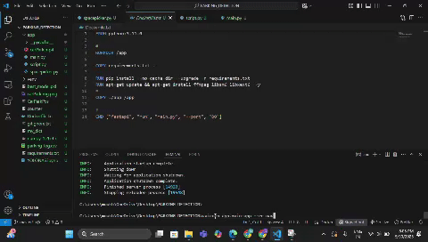

# Parking Detection Project

# 🚗 Automated Parking Space Detection System

A lightweight *real-time parking space monitoring system* that detects available parking spots using a static camera and computer vision. It displays a live video feed with slot status and offers a REST API for integration with other systems.

---

## 🔍 Features

- ✅ Detects *empty* and *occupied* parking spots
- 📺 *Live video stream* with slot annotations
- 🌐 *Real-time API* to fetch parking availability
- 🐳 *Dockerized* for easy deployment
- 🔧 Modular design, easy to understand and extend

---

## 🛠 Technologies Used

- *Python 3.8+*
- *OpenCV* – Image and video processing
- *cvzone* – Simplifies computer vision tasks
- *FastAPI* – Lightweight, high-performance web framework
- *Uvicorn* – ASGI server for FastAPI
- *Pickle* – To store marked parking slot data
- *Docker* – For containerization and easy deployment

---

## 🚀 API Endpoints

| Method | Endpoint         | Description                              |
|--------|------------------|------------------------------------------|
| GET    | /output        | Returns number and list of empty slots   |
| GET    | /video_feed    | Streams live video with slot annotations |

---

## Deployment Link

https://parking-detection.onrender.com/video_feed

---

## Video

